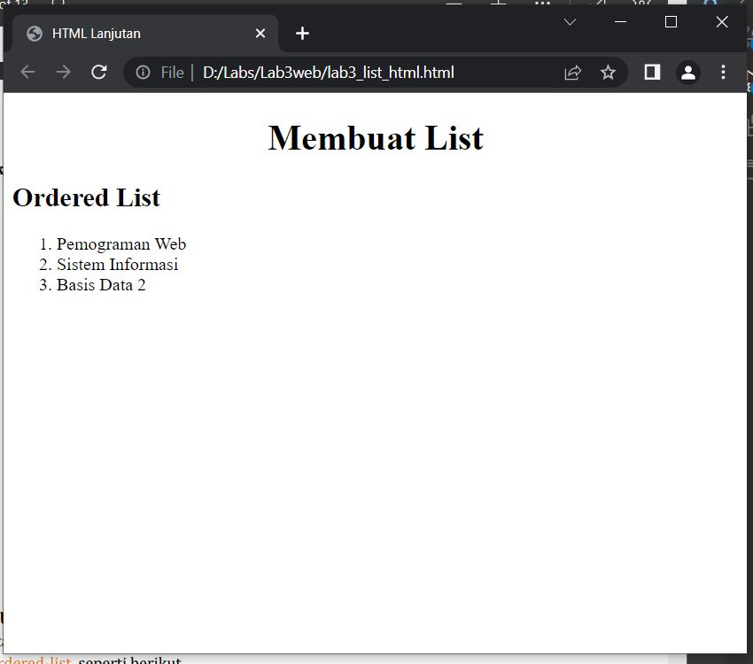
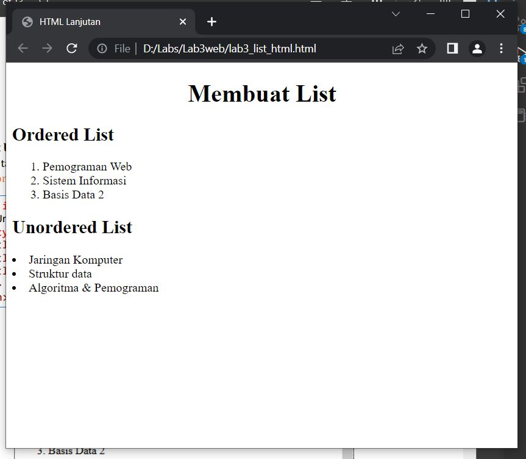
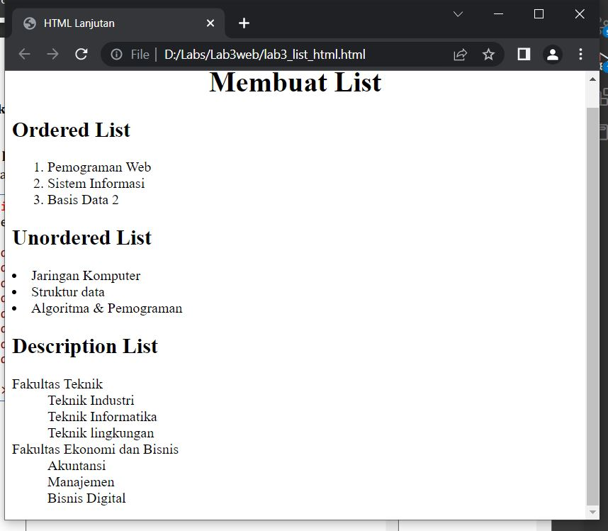
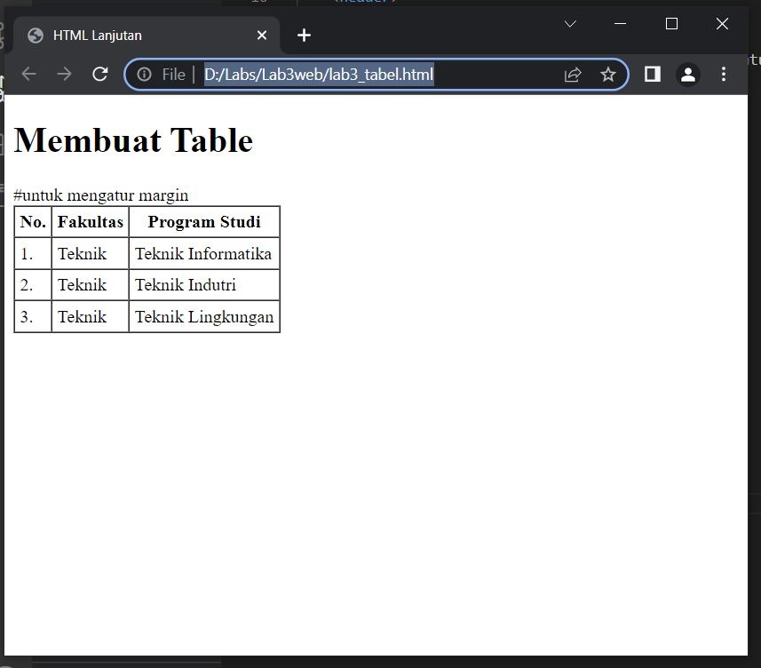
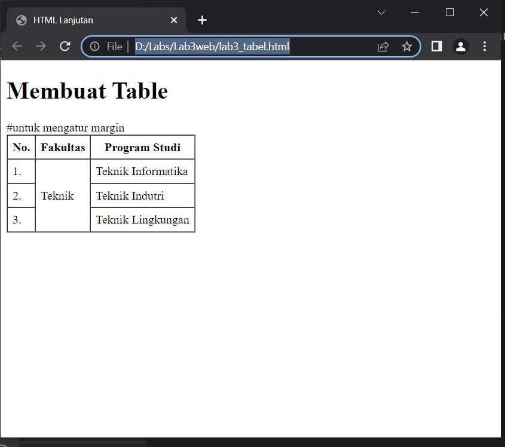
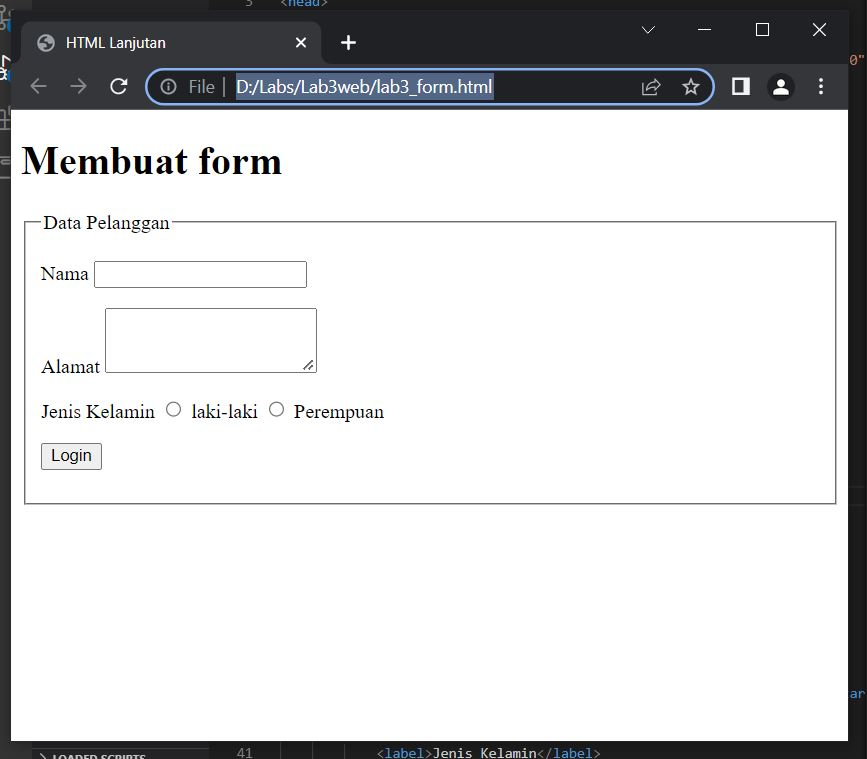
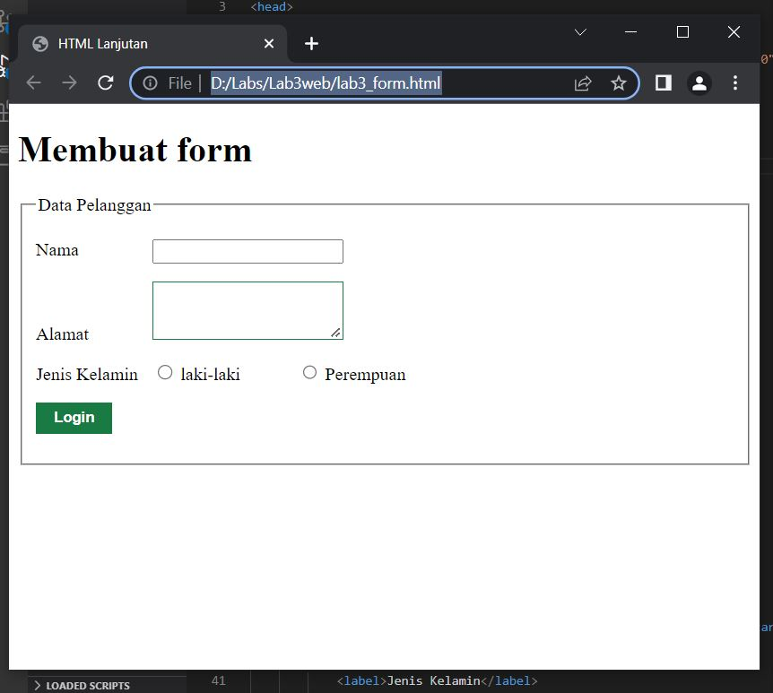

# Lab3web
# Praktikum 3

1. LIST
* Menampilkan Ordered list
- berikut hasilnya

* Menampilkan Unorderd List
berikut hasilnya

* Menampilkan Description List
berikut hasilnya

2. TABEL
* Menampilkan tabel
berikut hasilnya

* Menggabungkan sel data
berikut hasilnya

3. Membuat From
* Menampilkan Form
berikut haslnya

* menambahkan stylee pada form
berikut hasilnya

